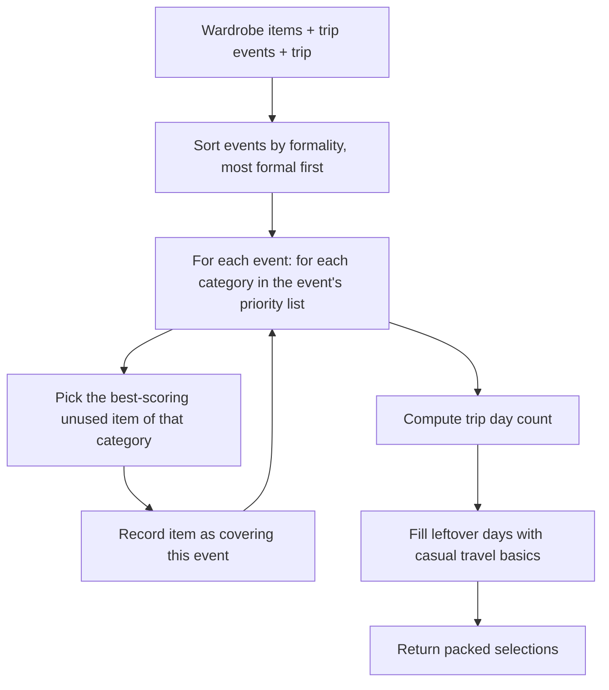

# Trip Planner Packing Algorithm

This document explains the packing algorithm used by the Charis Django `tripplanner` app.

The current implementation is **not an optimal solver**.
It is a **greedy capsule builder** that assigns a full set of complementary pieces
(one per garment category) to each scheduled event, then tops up the list with
casual daywear for the remaining days the trip spans. Items are chosen with a
formality-distance + season-match scoring heuristic.

## Where It Lives

- Algorithm: [`backend/apps/tripplanner/algorithms.py`](./algorithms.py)
- Trip creation and packing generation: [`backend/apps/tripplanner/views.py`](./views.py)
- Data model: [`backend/apps/tripplanner/models.py`](./models.py)

## What Problem It Solves

The trip planner needs to help a user decide:

- which wardrobe items should be packed for a trip
- which trip events each item is assigned to cover
- how to build a practical capsule — not just a bare minimum, but enough
  complementary pieces to actually dress for each event, plus basics for travel days

The algorithm works with:

- a list of `WardrobeItem` records
- a list of `TripEvent` records for one trip
- the trip itself (to compute how many days need packing)

## High-Level Idea

Instead of trying to find the *fewest* items that cover every event, the planner
builds a **capsule per event**: a formal gala gets a dress + shoes + bag +
outerwear, a casual hangout gets a top + bottom + shoes, and so on. After every
event has been fitted, any remaining trip days that are not already covered by a
piece get filled with casual travel basics.

Two rules steer the choices:

1. **Category coverage** — each event is fitted across a set of garment categories
   (`dress/top/bottom/shoes/bag/outerwear/accessory` for formal events, a smaller
   set for casual ones), so the result is a real outfit rather than one lone item.
2. **Fit scoring** — for a given category, the item that matches the event's
   formality and season the best is chosen.

## Flow



## Data Model Concepts

### Trip

The `Trip` model stores the trip itself:

- name
- destination
- start date
- end date
- description
- owner

### TripEvent

Each `TripEvent` represents one thing happening on the trip:

- date
- name
- formality required
- optional location
- optional notes

### PackingList

A `PackingList` belongs to one trip and stores the selected wardrobe items.

### PackingListItem

Each packing list item stores:

- the selected wardrobe item
- which event IDs it is assigned to cover

That `covers_event_ids` field is important because it makes the result explainable.
Travel/daywear pieces have an empty `covers_event_ids` list.

## The Season Logic

The algorithm uses a month-to-season map:

- December, January, February -> winter
- March, April, May -> spring
- June, July, August -> summer
- September, October, November -> fall

This is done with `SEASON_BY_MONTH` in `algorithms.py`.

For each `TripEvent`, the event date is mapped to a season.
For each `WardrobeItem`, the item's assigned seasons are read from the user's
wardrobe data.

An item whose seasons **do not** include the event season incurs a +5 penalty on
its fit score (`_item_fit`). An item with **no seasons at all** is treated as
season-agnostic and gets no penalty — the old "ignore unseasoned items" rule was
removed because it dropped useful pieces from the result.

## The Formality Rule

Fit is scored as:

```
fit = abs(item.formality_level - event.formality_required)
```

plus `+5` when the item's seasons exclude the event's season. An item is accepted
for an event when its total fit score is `<= 6` (small formality drift allowed,
but never bridging e.g. a casual 1 with a black-tie 5).

## Selection Strategy

The main function is `greedy_packing_list(wardrobe_items, trip_events, trip=None)`.

It works in two passes:

1. **Per-event capsule**
   - Sort events by required formality (most formal first).
   - For each event, walk the category priority list for its formality band
     (`CATEGORY_PRIORITY_BY_FORMALITY`) and, for each category, pick the unused
     item of that category with the best fit score (`_pick_for_event`).
   - Each picked item is recorded with `covers_event_ids=[event.id]` and removed
     from the candidate pool so no piece is packed twice.

2. **Travel daywear**
   - Compute the day count from the trip's start/end dates (falling back to the
     span of the event dates).
   - `travel_needed = max(0, day_count - len(selected))`.
   - Rotate through `top`, `bottom`, `shoes` and pick the lowest-formality unused
     item of each (`_pick_travel_item`), recording each with an empty
     `covers_event_ids`.

## Determinism

Choices are deterministic: for a given category and event, `min()` over the fit
score returns the first best candidate in the stable wardrobe list. Running the
same input twice yields the same packing list, which matters for testing,
debugging, and repeatable outputs.

## Why This Is Greedy

This is greedy because at each step it makes the best local choice — the best-fit
unused item for a category, or the lowest-formality piece for travel days. It
does **not** search all possible combinations, does not backtrack, and does not
prove global optimality.

That is a reasonable engineering tradeoff because:

- the input set is small or medium
- the problem needs to run fast
- a "good enough" capsule is acceptable

## What It Returns

The function returns a list of selections shaped like:

```python
[
    {
        "wardrobe_item": <WardrobeItem>,
        "covers_event_ids": ["event-uuid-1"],
    },
    {
        "wardrobe_item": <WardrobeItem>,
        "covers_event_ids": [],  # daywear / travel piece
    },
]
```

The Django view saves these selections into a `PackingList` and `PackingListItem`
records.

## End-to-End Request Flow

When a client hits:

`POST /api/trips/<trip_id>/generate-packing-list/`

the flow is:

1. Django loads the trip for the authenticated user.
2. Django loads that trip's events.
3. Django loads the user's wardrobe items.
4. `greedy_packing_list()` builds the per-event capsule plus travel daywear.
5. A `PackingList` record is created.
6. One `PackingListItem` row is created per chosen item.
7. The packed list is returned to the client.

## Complexity

Let:

- `I` = number of wardrobe items
- `E` = number of trip events
- `C` = number of categories tried per event (at most 7)

The per-event pass scans candidate items by category: roughly `O(E * C * I)`.
The travel pass adds at most `O(I)` more work. For typical user data that is
acceptable; if data grows, this could be optimized with precomputed category
buckets and cached season/formality scores.

## Strengths

- produces a fuller, usable capsule instead of a bare minimum
- deterministic and explainable (`covers_event_ids` maps items to events)
- fast enough for real trips
- season-agnostic items are still usable (no drop-off for untagged items)

## Limitations

- not globally optimal
- does not consider richer styling signals like color harmony, fabric, or weather
- treats season as month-based, which is a rough approximation
- category priority is a fixed heuristic, not learned from the user's style

## Example

Imagine a trip with these events:

- Beach brunch, summer, formality 2
- Dinner, summer, formality 4
- Airport travel day, summer, formality 1

And wardrobe items like:

- white shirt, summer, formality 3
- linen trousers, summer, formality 2
- blazer, summer, formality 4
- sneakers, summer, formality 1

The planner first fits the most formal event (Dinner, formality 4) with a
category-appropriate set, then the brunch, then fills the remaining travel day
with casual basics — e.g. the blazer for dinner, the shirt + trousers for brunch,
and sneakers as the travel-day shoe. Because it assigns multiple complementary
pieces per event, the result is a real outfit plan rather than a single item.

## Summary

The trip planner uses a **greedy capsule-building heuristic**: complementary
pieces per scheduled event (selected by formality + season fit) plus casual
daywear for the days the trip spans. It is deterministic, fast, and practical for
production even though it does not guarantee an optimal solution.