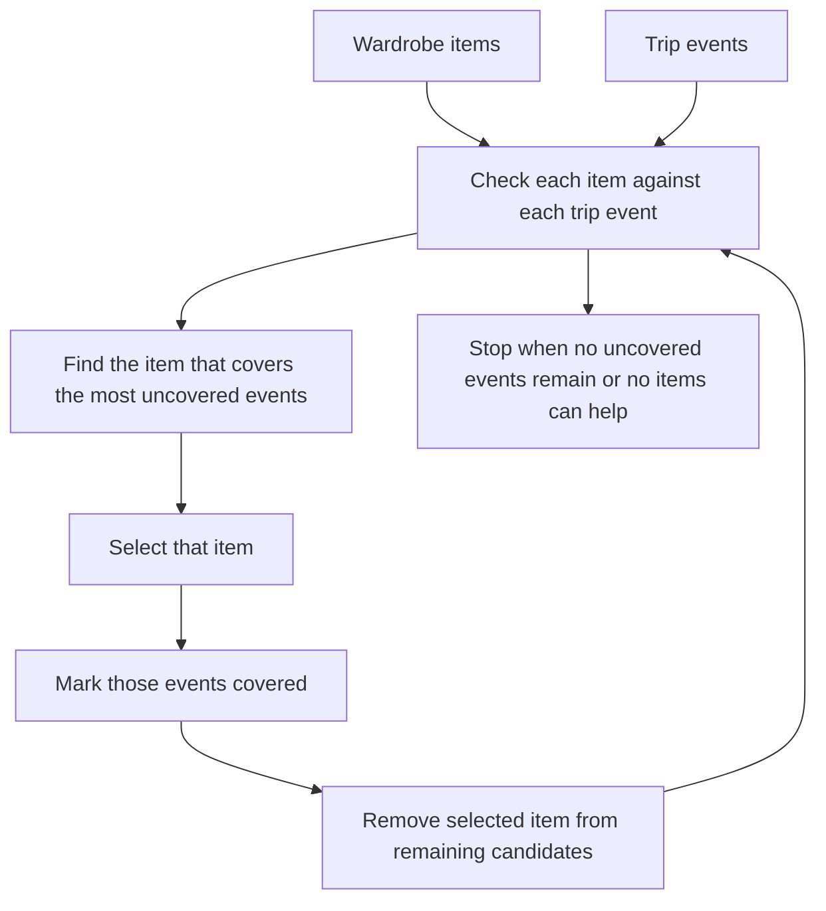

# Trip Planner Packing Algorithm

This document explains the packing algorithm used by the Charis Django `tripplanner` app.

The current implementation is **not an optimal solver**.
It is a **greedy packing heuristic** that tries to cover as many trip events as possible with the fewest wardrobe items, while staying within simple season and formality constraints.

## Where It Lives

- Algorithm: [`backend/apps/tripplanner/algorithms.py`](./algorithms.py)
- Trip creation and packing generation: [`backend/apps/tripplanner/views.py`](./views.py)
- Data model: [`backend/apps/tripplanner/models.py`](./models.py)

## What Problem It Solves

The trip planner needs to help a user decide:

- which wardrobe items should be packed for a trip
- which trip events each item can reasonably cover
- how to avoid overpacking while still covering the trip as well as possible

The algorithm works with:

- a list of `WardrobeItem` records
- a list of `TripEvent` records for one trip

It then chooses items that cover the most uncovered events first.

## High-Level Idea

Think of each wardrobe item as a candidate tool and each trip event as something that needs to be covered.

The algorithm asks:

> "Which single wardrobe item can cover the most trip events that are still uncovered?"

It picks that item, marks those events as covered, removes the item from future consideration, and repeats.

This is a classic greedy coverage strategy.

## Flow



## Data Model Concepts

### Trip

The `Trip` model stores the trip itself:

- name
- destination
- start date
- end date
- description
- owner

### TripEvent

Each `TripEvent` represents one thing happening on the trip:

- date
- name
- formality required
- optional location
- optional notes

### PackingList

A `PackingList` belongs to one trip and stores the selected wardrobe items.

### PackingListItem

Each packing list item stores:

- the selected wardrobe item
- which event IDs it helps cover

That `covers_event_ids` field is important because it makes the result explainable.

## The Season Logic

The algorithm uses a month-to-season map:

- December, January, February -> winter
- March, April, May -> spring
- June, July, August -> summer
- September, October, November -> fall

This is done with `SEASON_BY_MONTH` in `algorithms.py`.

For each `TripEvent`, the event date is mapped to a season.
For each `WardrobeItem`, the item's assigned seasons are read from the user's wardrobe data.

An item only counts as compatible with an event if the item's seasons include the event season.

## The Formality Rule

The algorithm also checks formality.

It allows a wardrobe item to cover an event when:

- `abs(item.formality_level - event.formality_required) <= 1`

That means the item does not have to match the event formality exactly.
It just needs to be close enough.

Examples:

- item formality `3`, event formality `3` -> allowed
- item formality `3`, event formality `4` -> allowed
- item formality `2`, event formality `4` -> not allowed

This gives the planner some flexibility while still respecting the trip context.

## Coverage Rule

An item covers an event only if both conditions are true:

- season match
- formality match

In code, that logic is in `_item_covers_event()`.

If an item has no seasons at all, it is automatically ignored.

That is a useful safety rule because an item without seasonal metadata is too weak to trust in the packing result.

## Greedy Selection Strategy

The main function is `greedy_packing_list()`.

It works like this:

1. Collect all uncovered event IDs.
2. Start with all wardrobe items as candidates.
3. For each remaining item, compute which uncovered events it can cover.
4. Pick the item that covers the largest number of uncovered events.
5. Add that item to the result.
6. Remove the covered events from the uncovered set.
7. Remove the selected item from future consideration.
8. Repeat until nothing useful remains.

## Tie-Breaking

Sometimes two items cover the same number of events.

The algorithm then breaks ties deterministically by comparing:

1. item name in lowercase
2. item UUID as a string

This matters because it keeps the algorithm stable.

If the same input is run twice, the same result should be returned.

That determinism is important for:

- testing
- debugging
- repeatable packing outputs

## Why This Is Greedy

This is greedy because it makes the best local choice at each step.

It does **not** search all possible combinations.
It does **not** backtrack.
It does **not** prove optimality.

It simply chooses the currently best item based on immediate coverage.

That is often a good engineering tradeoff when:

- the input set is small or medium
- the problem needs to run fast
- a "good enough" packing plan is acceptable

## What It Returns

The function returns a list of selections shaped like:

```python
[
    {
        "wardrobe_item": <WardrobeItem>,
        "covers_event_ids": ["event-uuid-1", "event-uuid-2"]
    }
]
```

The Django view then saves these selections into a `PackingList` and `PackingListItem` records.

## End-to-End Request Flow

When a client hits:

`POST /api/trips/<trip_id>/generate-packing-list/`

the flow is:

1. Django loads the trip for the authenticated user.
2. Django loads that trip's events.
3. Django loads the user's wardrobe items.
4. `greedy_packing_list()` evaluates coverage.
5. A `PackingList` record is created.
6. One `PackingListItem` row is created per chosen item.
7. The packed list is returned to the client.

## Why It Is Not Optimal

This algorithm is intentionally simple.

It does not guarantee the fewest possible wardrobe items.
It does not search for the mathematically best outfit subset.

For example, a globally optimal solution might require checking all combinations of items, which becomes expensive very quickly.

Instead, this implementation chooses a practical heuristic:

- simple
- fast
- predictable
- easy to explain

For Charis, that is a sensible product decision for now.

## Complexity

Let:

- `I` = number of wardrobe items
- `E` = number of trip events

Each greedy round checks all remaining items against all events.

Roughly speaking, the runtime is on the order of:

- `O(I * E * I)` in the worst case, because each chosen item is removed and we re-scan remaining items

For typical user data, that is acceptable.

If the data size grows significantly, this could be optimized later with:

- precomputed coverage maps
- cached season/formality buckets
- candidate pruning

## Strengths

- easy to understand
- deterministic
- explainable to users
- fits Django's conventional backend style
- fast enough for a first production version

## Limitations

- not globally optimal
- depends on season metadata being present
- treats season as month-based, which is a rough approximation
- uses a simple formality distance rule
- does not yet consider richer styling signals like color harmony, fabric, or weather

## Example

Imagine a trip with these events:

- Beach brunch, summer, formality 2
- Dinner, summer, formality 4
- Airport travel, summer, formality 1

And wardrobe items like:

- white shirt, summer, formality 3
- linen trousers, summer, formality 2
- blazer, summer, formality 4
- sneakers, summer, formality 1

The algorithm may choose:

1. the shirt because it covers the most events
2. the trousers because they cover the remaining casual and mid-formality events
3. the blazer because it covers the dinner event

It is trying to maximize coverage without packing unnecessary duplicates.

## Summary

The trip planner uses a **greedy coverage-based packing heuristic**.

It is not an optimal solver, but it is:

- deterministic
- easy to reason about
- practical for production

That makes it a good fit for the current Charis backend.
